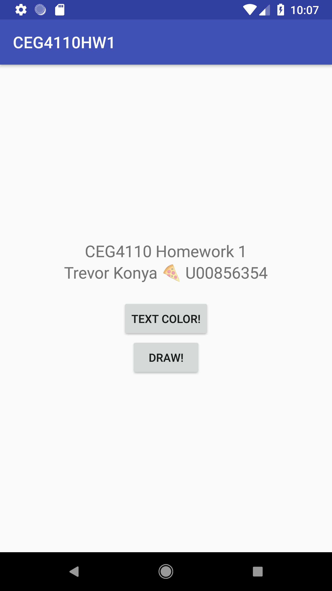
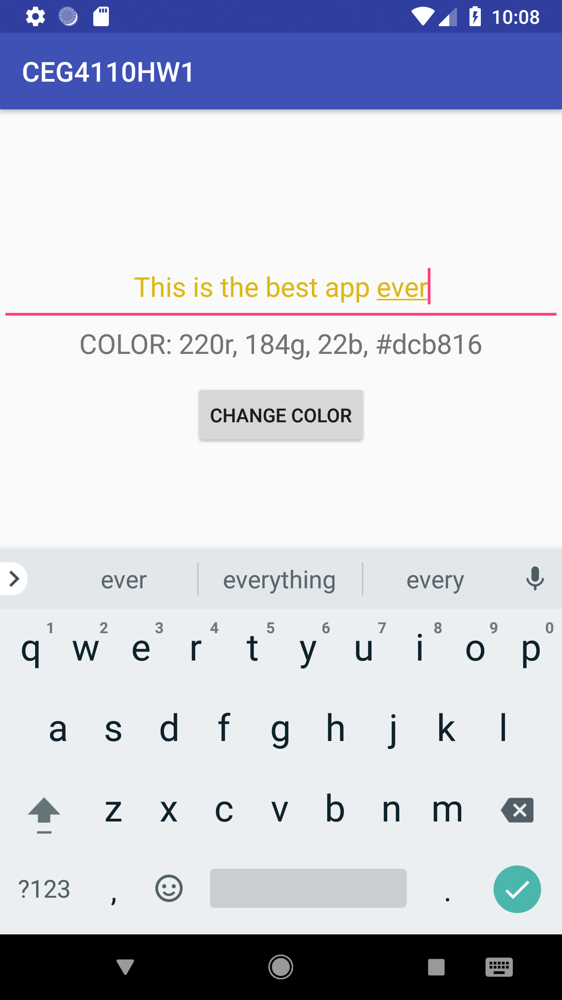
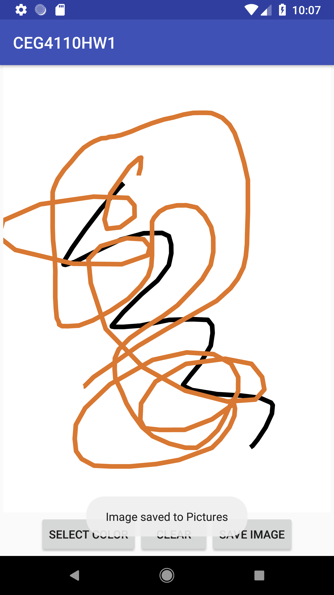
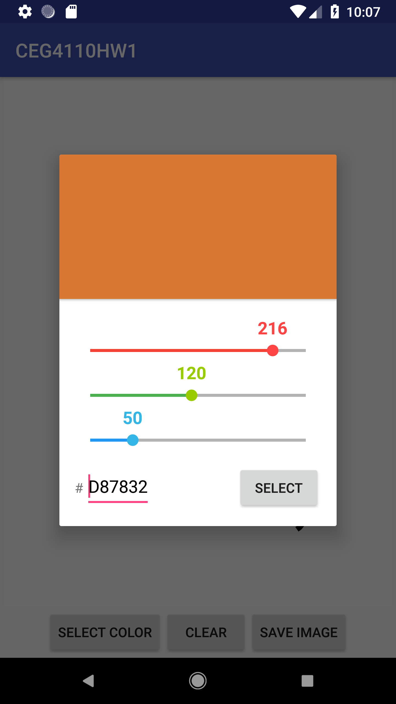

# CEG 4110 Homework 1: Text Color and Drawing Android App

This is a simple app which contains two functions:
1. Randomly change the color of text, and display both the hex and rgb values
2. Make a drawing, optionally with different colors, and save or share it

# Requirements

This app needs only one permission: "Storage". This is used to save the drawn images. This will be requested once when the app first launches, and each time the "Save Image" button is hit if the permission has not been granted. 

Development was done against API Level 27 / Android 8.1. It may, but it is not guaranteed to work with any lower version.

# Development and Design

This project was written in Kotlin, for educational purposes. I'm already pretty familiar with Java, and have wanted to learn Kotlin for a while, thus I decided this would be a good opportunity to force myself to use it. My impressions of the language so far are positive. Android Studio was the IDE used. Testing was done on a virtual Nexus 6P, an actual Nexus 6P, and a first-gen Pixel. 

The app is implemented with only a few simple classes:

### Main Activity

This is the starting activity. It lists my name, UID, and course number, and contains two buttons, one to start each of the other activities.

### TextActivity

This is the text color activity, which features a user-editable text box, a non-editable text box which displays the color in RGB and Hex format, and a button which randomly changes the color of the text. The RGB and Hex values are changed each time the button is pressed to correspond to the new random color.

### CustomDrawingView

This is a class which extends View, and allows the user to draw on it. It is a required component of the following activity class. It contains an array of Paint and Path which are used to keep track of which strokes are what color.

### DrawActivity

The draw activity allows the user to draw a simple image and save it to their device. This is implemented with the built-in android classes Paint, Path and Canvas. There are two buttons at the bottom which allow color changing and saving. Color changing was implemented by including a library (see References section), and saving is handled by simple built-in android features. The user is notified that the save was successful with a toast message.

### Color picker library

A color picker library was used for the colors. It is a simple modal that pops up and allows the user to adjust red, green and blue individually. See references section for link.

# References

The following resources were used for this project:

+ [The Official Android Documentation](https://developer.android.com/docs/)

+ [Android Material Color Picker Dialog](https://github.com/Pes8/android-material-color-picker-dialog)

+ [Creative Punch: Make a basic single touch drawing app for Android](http://creative-punch.net/2014/03/make-basic-single-touch-drawing-app-android/)